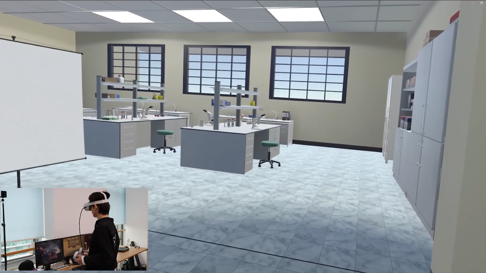

# Chemistry VR

## Abstract
Experiment is an essential part of chemistry education. However, it is equipment- and space-demanding, and sometimes risky. Immersive and interactive simulations in Virtual Reality (VR) can address these issues. In this project, we developed a virtual laboratory based on China's ninth grade chemistry textbook published by People's Education Press. The system provides safety training and step-by-step tutorials so that students can learn from interactive simulations and observations of realistic experimental phenomena in a safe condition. Our system provides a risk-free approach and effectively supports practice-led and experiential learning of chemistry.

## People
Xuansheng Xia, [Guanxuan Jiang], Shuhao Zhang

## Award
CCVR 2022 Second Prize

[Guangxuan Jiang]: https://jgxuann.github.io/
