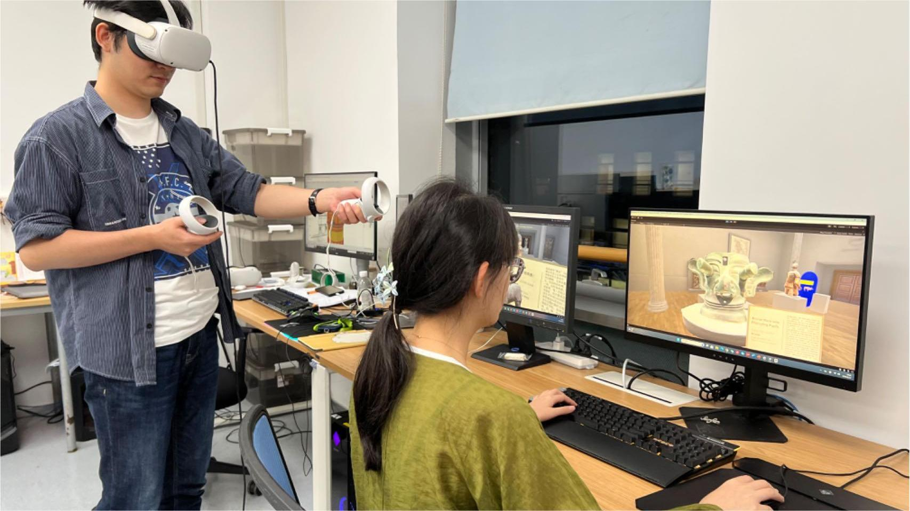

# CovisitVM


## Abstract
Virtual Reality Head-Mounted Displays (VR HMDs) are the main ways for users to immerse in a virtual environment and interact with its virtual objects. The experiences of those around the VR HMD users and their effects on HMD users’ experiences have not been well studied. In this work, we invite participants to engage in a cross-reality virtual museum visit. With low, medium, and high degrees of non-HMD user involvement, they could incrementally observe, navigate within, and interact with the virtual museum. Our study provides insights into the design of engaging multiuser VR experiences and cross-reality collaborations.

## People
Xuansheng Xia, [Yue Li], [Hai-Ning Liang]

## Publications
Xia, X., Li, Y., & Liang, H.-N. (2024). CovisitVM: Cross-Reality Virtual Museum Visiting. 2024 IEEE Conference on Virtual Reality and 3D User Interfaces Abstracts and Workshops (VRW), 1074–1075. DOI: 10.1109/VRW62533.2024.00333

---
[Yue Li]: https://imyueli.github.io/
[Hai-Ning Liang]: https://cma.hkust-gz.edu.cn/people/hai-ning-liang/
```
