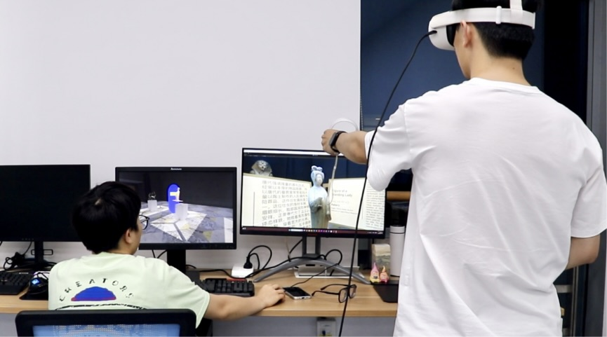

# Cross-Reality Interaction and Collaboration

## Abstract
With Virtual Reality Head-Mounted Displays (VR HMDs) establishing themselves as a potent platform for collaborative tasks, their cross-reality capability and cross-domain applicability remain largely unexplored. This study intends to assess the effectiveness of cross-reality collaboration systems using a VR HMD and a desktop PC across three disparate sectors: museum visiting, chemical education, and assisted rehabilitation. The systems were designed to support social interactions and scenario-specific collaborative tasks. Evaluation of the systems showed above-average system usability and user experience. By probing into these varied environments, our study offers a comprehensive understanding of the applicability of such collaborative cross-reality systems in real scenarios, potentially fostering more immersive, efficient, and enriching multi-field applications of cross-reality technologies.

## People
Xuansheng Xia, Jiachen Liang, Ruixiang Zhao, Ziyue Zhao, Mingze Wu, [Yue Li], Hai-Ning Liang

## Publication
Xia, X., Liang, J., Zhao, R., Zhao, Z., Wu, M., Li, Y., & Liang, H. N. (2023, October). Cross-Reality Interaction and Collaboration in Museums, Education, and Rehabilitation. In 2023 IEEE International Symposium on Mixed and Augmented Reality Adjunct (ISMAR-Adjunct) (pp. 815-820). IEEE.

## Award
IEEE ISMAR 2023 Shortlisted

[Yue Li]: https://imyueli.github.io/
