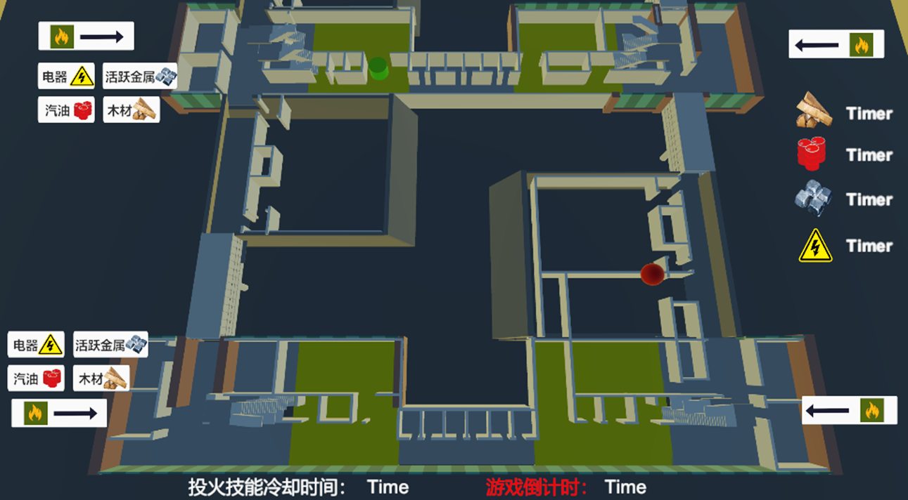

# Fire Escape

## Abstract
In this paper, we present a multi-user fire escape simulation training system that involves an actionist in Virtual Reality (VR) and a strategist using a desktop. We implemented two game modes (collaboration and competition) and conducted a comparative study to investigate how user experiences and learning outcomes vary between the two game modes, and between the two roles in the gameplay. The learning outcomes using the simulation training were compared against a baseline condition, where participants learned the fire escape knowledge by reading paper instructions. Our results revealed that users reported higher perceived usability and lower workload in the collaboration mode than in the competition mode. In addition, actionists (VR users) reported greater performance but also greater mental workload than strategists (desktop users). In terms of learning outcomes, strategists showed greater improvement than actionists. However, the improvement in learning outcomes did not vary significantly from the baseline condition. We discussed the effects of game modes and role-playing on user experience and learning outcomes and the implications for future interactive educational systems.

## People
Zelin Jiang, Shuhao Zhang, [Yue Li], Ka Lok Man, Yong Yue, Jeremy Smith

## Publication
Jiang, Z., Zhang, S., Li, Y., Man, K., Yue, Y., & Smith, J. (2024) Is VR Always a Better Choice? Investigating the Effects of Game Modes and Role-Playing on Fire Escape Simulation Training. 2024 the 10th International Conference on Virtual Reality.

[Yue Li]: https://imyueli.github.io/
