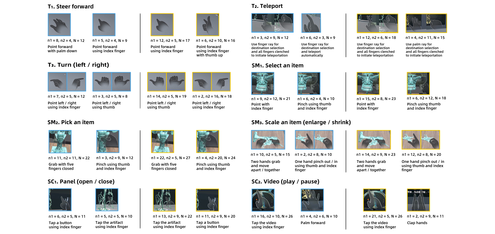

# Gestures in VR Museums

## Abstract
Recognizing the potential of freehand gestures for interacting with virtual objects in virtual environments, our research introduces a user-defined freehand gesture set of typical referents in virtual reality (VR), focusing on a specific scenario: VR museums. We conducted a comprehensive elicitation study with two experiments to define
and refine the gesture set. Meanwhile, we demonstrated an enhanced real-time Wizard of Oz approach that facilitated users’ understanding of referents in VR and their gesture design. Our findings revealed significant improvements in gesture consistency and user agreement through two experiments, with an average agreement score of first-choice and second-choice advancing from 0.211 and 0.160 to 0.412 and 0.284, respectively. By offering a consistent user-centered gesture set, this work contributes to guiding museum curators toward creating more immersive user experiences in VR museums. The gestures can also be extended to other VR applications that necessitate travel, selection and manipulation, and system control tasks.

## People
Qianru Liu, [Yue Li], [Bingqing Chen], Huiyue Wu, [Hai-Ning Liang]

## Publications
Liu, Q. R., Li, Y., Chen, B. Q., Wu, H. Y., & Liang, H. -N. (2024). User-Defined Gesture Interactions for VR Museums: An Elicitation Study. 2024 IEEE International Symposium on Mixed and Augmented Reality(ISMAR), 633-642. IEEE. DOI: 10.1109/ISMAR62088.2024.00078

[Yue Li]: https://imyueli.github.io/
[Jiachen Liang]: ../team/phd_students/Bingqing%20Chen
[Hai-Ning Liang]: https://cma.hkust-gz.edu.cn/people/hai-ning-liang/
