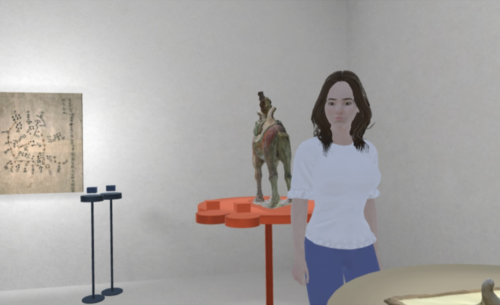

# Interactivity, UGC, and Proximity

## Abstract
Hybridity in immersive technologies has not been studied for factors that are likely to influence engagement. A noticeable factor is the spatial enclosure that defines where users meet. This involves a mutual object of interest, contents that the users may generate around the object, and the proximity between users. This study examines these factors, namely how object interactivity, user-generated contents (UGC) and avatar proximity influence engagement. We designed a Hybrid Virtual and Augmented Reality (HVAR) environment that supports paired users to experience cultural heritage in both Virtual Reality (VR) and Augmented Reality (AR). A user study was conducted with 60 participants, providing assessments of engagement and presence via questionnaires, together with mobile electroencephalogram (mEEG) and user activity data that measures VR user engagement in real-time. Our findings provide insights into how engagement between users can occur in HVAR environments for the future hybrid reality with multi-device connectivity.

## People
Yue Li, Eugene Ch'ng, Sue Cobb

## Publication
Li, Y., Ch’ng, E., & Cobb, S. (2023). Factors Influencing Engagement in Hybrid Virtual and Augmented Reality. ACM Transactions on Computer-Human Interaction, 30(4), 1–27. DOI: 10.1145/3589952
