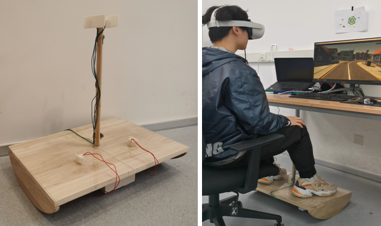

# LeanOn

## Abstract
Locomotion plays a critical role in user experience in Virtual Reality (VR). This work presents a novel locomotion device, LeanOn, which aims to enhance immersion and feedback experience in VR. Inspired by balance vehicles, LeanOn is a leaning-based locomotion device that allows users to control their transform location by tilting a board on two balance wheels, with transform rotation enabled by two buttons near users' feet. To create a more realistic riding experience, LeanOn is equipped with a terrain vibration system that generates varying levels of vibration based on the roughness of the terrain. We conducted a within-subjects experiment (N=24) and compared the use of LeanOn and joystick steering in four aspects: cybersickness, spatial presence, feedback experience, and task performance. Participants used LeanOn with and without the vibration system to investigate the necessity of tactile feedback. The results showed that LeanOn significantly improved users' feedback experience, including autotelic, expressivity, harmony, and immersion, and maintained similar levels of  cybersickness or spatial presence, compared to joystick steering. Our work contributes to the field of VR locomotion by validating a leaning-based steering prototype and showing its positive effect on improving users’ feedback experience in VR. We also showed that tactile feedback in locomotion is necessary to further enhance immersion in VR.

## People
Ziyue Zhao, Yue Li, Hai-Ning Liang

## Publication
Zhao, Z., Li, Y., & Liang, H.-N. (2023). LeanOn: Simulating Balance Vehicle Locomotion in Virtual Reality. 2023 IEEE International Symposium on Mixed and Augmented Reality (ISMAR), 415–424. DOI: 10.1109/ISMAR59233.2023.00056
