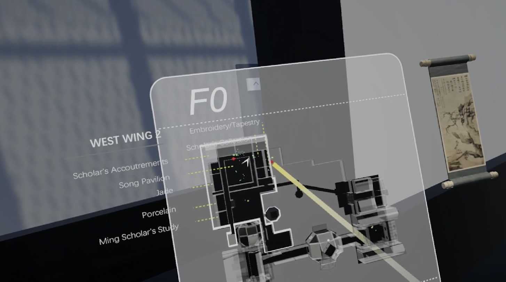

# Magic Map

## Abstract
Museum visitors are typically advised to follow trajectories planned by curators. Nevertheless, the diverse locomotion techniques available in Virtual Reality (VR) offer various navigation methods that are unattainable within physical museum spaces. Interestingly, these techniques have rarely been explored within museum settings. Our study aims to investigate appropriate navigation methods in VR museums. We first conducted a study in a virtual reconstruction of a local museum with the following navigation methods: a 2D minimap, a World-in-Miniature (WiM) system, and a WiM map. Our results showed that the WiM map with a point-and-select interaction technique outperformed the other two regarding ease of learning, reduced workload, lessened motion sickness, and greater user preferences. Based on the findings, we improved the WiM map and introduced MagicMap. It builds upon the WiM map and translates the curatorial principles of museum visiting into a hierarchical menu layout. Our further evaluation showed that MagicMap supported prolonged engagement in VR museums, enhanced system usability and overall user experience, and reduced users’ perceived workload. Our findings have implications for the future design of navigation systems in VR museums and complex indoor environments.

## People
[Xueqi Wang], [Yue Li], Hai-Ning Liang

## Publications
Wang, X., Li, Y., & Liang, H. N. (2024, March). MagicMap: Enhancing Indoor Navigation Experience in VR Museums. In 2024 IEEE Conference Virtual Reality and 3D User Interfaces (VR) (pp. 881-891). IEEE.

[Xueqi Wang]: https://xueqiwang.cargo.site/
[Yue Li]: https://imyueli.github.io/
