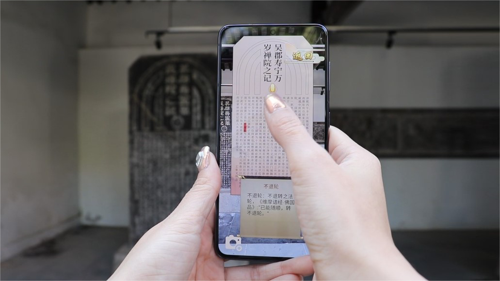

# Shuangta AR

## Abstract
Cultural heritage (CH) plays an important role in realizing the Sustainable Development Goals (SDGs). In this paper, we focus on emerging technologies such as Augmented Reality (AR) and gamified learning to foster public understanding of cultural values in historical contexts. We design HeritageSite AR, an exploration game for onsite CH learning and visits with publics in Relics of Arhat Monastery and Twin Pagoda (also known as Shuangta. Based on research investigation of technical means, expert semi-structured interviews and online survey,  we distill and incorporate four design goals using user journey map. The implemented game design is evaluated with respect to three design components (i.e., reality, meaning, play) and four stages (i.e., trigger, engage, consolidate, relate) in CH visits. We conclude our work with a discussion of contributions to SDGs.

## People
[Ningning Xu], Jiachen Liang, Kexiang Shuai, Yuwen Li, Jiaqi Yan, [Yue Li], Yiping Dong

## Publication
Xu, N., Liang, J., Shuai, K., Li, Y., & Yan, J. (2023, April). HeritageSite AR: An Exploration Game for Quality Education and Sustainable Cultural Heritage. In Extended Abstracts of the 2023 CHI Conference on Human Factors in Computing Systems (pp. 1-8). 

[Ningning Xu]: https://axiosly.github.io/
[Yue Li]: https://imyueli.github.io/
