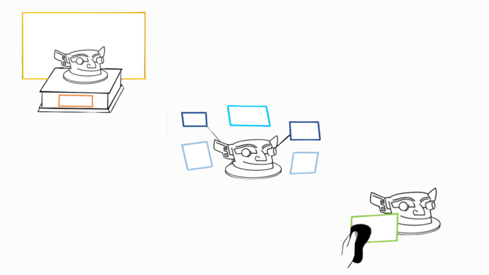

# Text Layout in VR Museums

## Abstract
In a physical museum, text descriptions are typically displayed on placards or signage next to exhibits. Within a virtual museum environment, these text descriptions can be presented in various ways, such as fixed in the virtual environment, attached to the exhibits, or held in users’ hands. By seamlessly integrating text descriptions into the virtual environment and allowing users to engage with the content, the information presentation can be highly interactive. However, the design space of artifact information presentation in virtual museums was under-explored. In this paper, we investigated appropriate ways to present text descriptions of artifacts in immersive virtual museums. Specifically, we studied (1) users’ perceived importance of various information dimensions (observable, non-observable, and interpretation), (2) users’ expected display of text panels (shown or hidden), and (3) the relationship between the artifact information dimensions and layout types (environment-, object-, and user-based). Our results showed that participants rated significantly higher importance for non-observable information than observable and interpretation information. In addition, we summarize a design space for artifact information presentation using different layout types with prioritized options. Our work provides insights for the interaction design of artifact information in virtual museums and the presentation of text in virtual reality.

## People
Yuexin Yao, [Yue Li]

## Publications
Yao, Y. X. and Li, Y. (2024). Textual Information Presentation in Virtual Museums: Exploring Environment-, Object-, and User-based Approaches. 2024 IEEE International Symposium on Mixed and Augmented Reality(ISMAR), 525-533. IEEE. DOI: 10.1109/ISMAR62088.2024.00067

[Yue Li]: https://imyueli.github.io/
