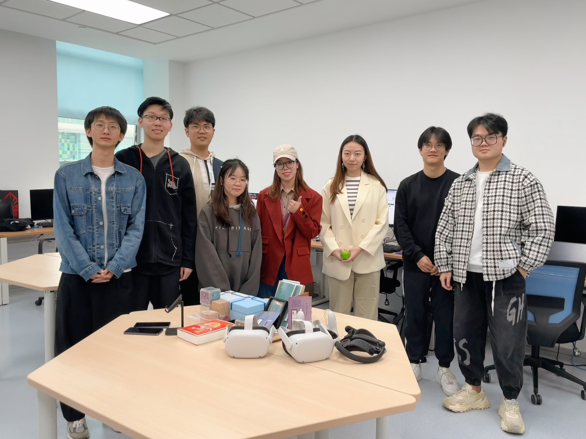
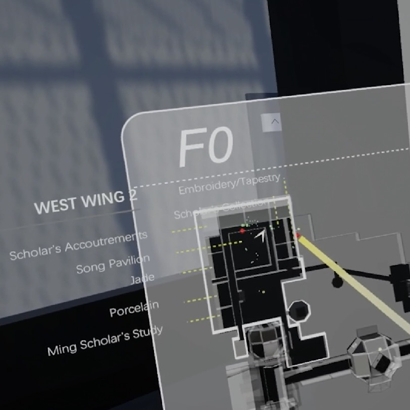
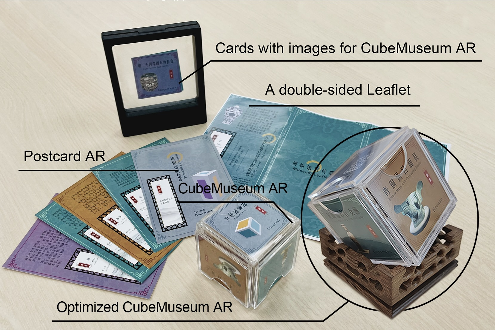
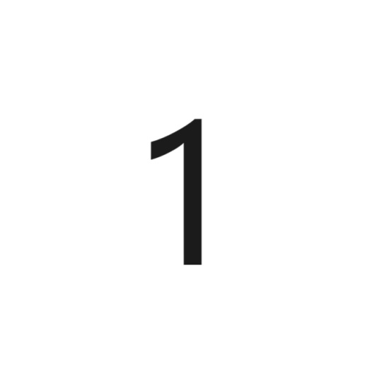
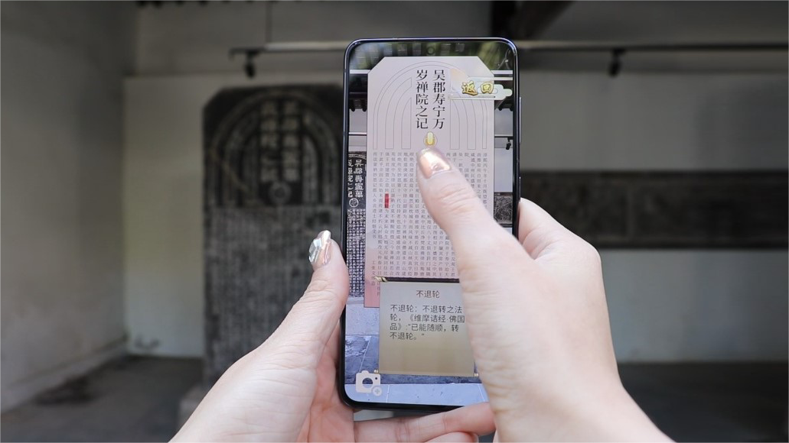
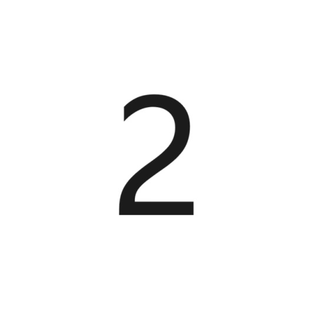

**HER Lab (Heritage, Edutainment, and Reality)** is a research team led by [Dr Yue Li], focusing on advancing the fields
of cultural heritage, education, and entertainment by novel technologies and reality-based experiences. We derive
practical implications from Human-Computer Interaction (HCI), Virtual Reality (VR), and Augmented Reality (AR), while
drawing theoretical insights from heritage and education research. By employing a user-centered approach, we design,
develop, and evaluate novel interfaces and interaction techniques that enhance future experiences of heritage,
education, and play.

Operating since 2021, HER Lab is based at the School of Advanced Technology, Xi'an Jiaotong-Liverpool University (
XJTLU). It is an interdisciplinary research team with passionate and motivated undergraduate, postgraduate, and PhD
students.

<head>
  <link rel="stylesheet" href="css/flickity.css" media="screen">
</head>
<body>
    

        
        
        
        
    

  
</body>

---

## Featured Projects

    <a href="docs/projects/MagicMap" class="content1">
        
        
MagicMap

    </a>
    <a href="docs/projects/CubeMuseumAR" class="content1">
        
        
CubeMuseum AR

    </a>
    <a href="docs/projects/Interactivity,%20UGC,%20and%20Proximity" class="content1">
        
        
Interactivity, UGC, and Proximity

    </a>

[//]: # (## Games and Gamified Learning)

[//]: # ()

[//]: # (
)

[//]: # (    <a href="https://example.com" class="content2">)

[//]: # (        )

[//]: # (        
CubeMuseum AR
)

[//]: # (    </a>)

[//]: # (    <a href="docs/projects/ShuangtaAR" class="content2">)

[//]: # (        )

[//]: # (        
Shuangta AR
)

[//]: # (    </a>)

[//]: # (
)

[//]: # ()

[//]: # (## Cross Reality Experience)

[//]: # ()

[//]: # (
)

[//]: # (    <a href="https://example.com" class="content2">)

[//]: # (        )

[//]: # (        
Interactivity, UGC, and Proximity
)

[//]: # (    </a>)

[//]: # (    <a href="https://example.com" class="content2">)

[//]: # (        )

[//]: # (        
Presence and Communication
)

[//]: # (    </a>)

[//]: # (
)

[//]: # ()

[//]: # (# News)

[//]: # ()

[//]: # (Here's what's happening in the lab right now.)

----

[Dr Yue Li]: https://imyueli.github.io/

